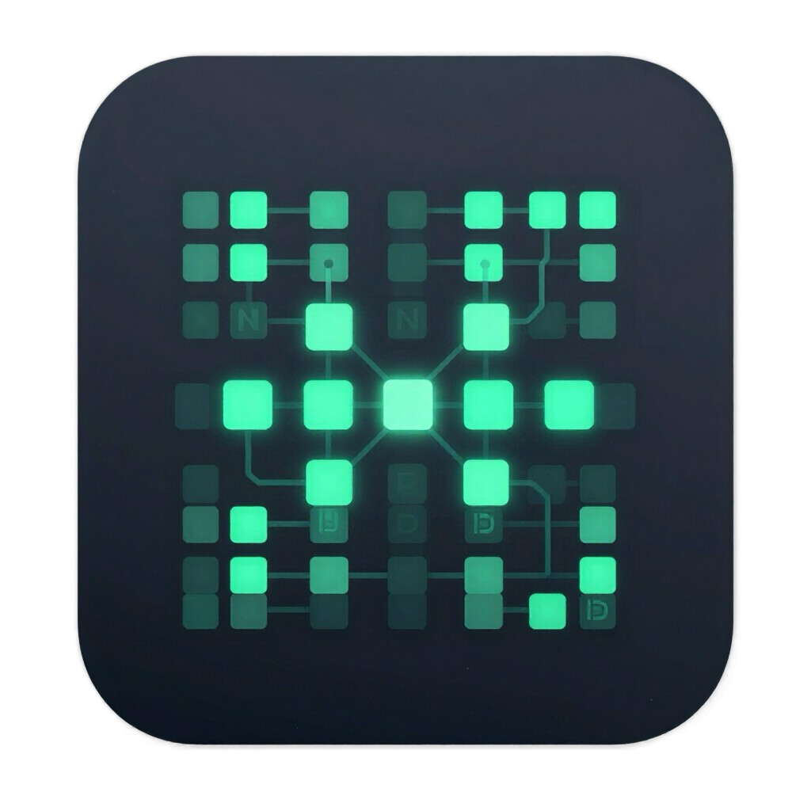

<div align="center">



# D-Router

**A real-time, low-latency NxM audio routing matrix for macOS.**

*by ZDAudio*


</div>

---

D-Router is a software patchbay / routing matrix that connects any combination of
audio devices on your Mac — physical interfaces and virtual loopbacks — and
freely routes channels between them with per-crosspoint gain, sample-rate
conversion, plug-in insert chains, and linked group faders.

> **Status: private beta.** Pre-release software, under active development. Not
> for redistribution. This repository hosts **downloads and release notes**;
> the source code is not public.

## Download & install

1. Grab the latest **`D-Router.zip`** from the
   [**Releases**](https://github.com/ZDAudio/D-router/releases) page.
2. Unzip and drag **D-Router.app** into `/Applications`.
3. The app is ad-hoc signed (not notarized). If macOS reports the app is
   *"damaged"* or refuses to open it, clear the quarantine flag once:

   ```bash
   xattr -cr /Applications/D-Router.app
   ```

D-Router includes an **opt-in auto-updater** (Config menu) that checks this
repository for new releases — after the first manual install you can update
from inside the app.

## Three ways to use it

### 1 — A system mixer for your Mac
**Pull every sound on your computer into one mixer, out to your speakers.**

- Capture any app's audio per-app (players, browsers, calls, games) alongside
  microphones and hardware inputs, each as its own strip
- Give every source its own effect chain: a Leveler to steady wandering
  loudness, Auto-EQ to smooth harsh frequencies and steady the tone, plus
  de-essing, compression and EQ — so movies, streams and meetings always sound
  consistent
- Virtual tracks + a Pad Player for beds and stingers; a built-in recorder
  captures any strip to disk
- One click sets it as the system default output

**For**: everyday listening, streaming/screen recording, edit review, remote
meetings.

### 2 — An audio router between hardware devices
**Any interface to any interface, across clock domains.**

- NxM matrix: route any input of any device to any output of any other, with
  independent per-crosspoint levels
- The built-in ASRC layer absorbs clock drift between devices — interfaces with
  different clocks interconnect directly, no pops, no drift
- Phase-locked group resampling keeps multichannel signals coherent across
  devices; plugin delay compensation (PDC) is available
- Input/output group management (VCA / Router fader modes); snapshots save the
  whole setup in one click

**For**: multi-interface studios, device bridging, complex signal distribution.

### 3 — A professional DSP node / monitor controller on a single interface
**Lock to the device clock, bit-exact path, processing on every output.**

- Device-Clock mode: with a single interface the ASRC layer switches itself
  off and audio takes a bit-exact 1:1 path — much lower CPU and latency (the
  status panel shows the active clock mode)
- Monitor control: master volume plus independent trim/mute/polarity per output
- Per-output processing: 16-band calibration EQ, sample-accurate Time Align,
  convolution A/B monitoring — pair with your measurement software for full
  multichannel room calibration
- SuperRouter mode unlocks output groups up to 64 channels for large immersive
  rooms

**For**: studio monitor control, multichannel/immersive room calibration, fixed
DSP installations.

## Built-in plug-ins

D-Router ships a growing suite of built-in DSP plug-ins — no external
dependencies needed to get useful processing on any channel or bus:

| | | |
|---|---|---|
| Gain / Utility | HP/LP Filter | 5-band Parametric EQ |
| Compressor | Noise Gate | Limiter |
| Reverb Pro | Delay | Tone Generator |
| Tremolo | Stereo Width | De-esser |
| Channel Strip | Multiband Compressor (4-band) | Level Rider |
| PPM Meter | Spectral Auto-EQ | Resonance Suppressor |
| LUFS Meter | Dynamic EQ | Stereo2Mono |

Several ship with custom visual editors (EQ curve + spectrum, compressor
transfer + GR meter, level-rider gain history, spectral curve, PPM ballistics).

## Recommended setup — capturing your Mac's audio (BlackHole)

macOS has no built-in way to feed system and app audio into a router. The
smoothest way to get the most out of D-Router is to pair it with
**[BlackHole](https://existential.audio/blackhole/)** — a free, open-source
virtual audio driver for macOS. You point macOS's output at BlackHole, and
D-Router reads it back and routes it anywhere, with processing, multi-device
output, and group control.

**Install** — via Homebrew, or the installer from
[existential.audio](https://existential.audio/blackhole/):

```bash
brew install blackhole-2ch      # stereo / normal use
brew install blackhole-16ch     # multichannel / spatial audio
```

**Pick the channel count:**

- **Normal (stereo)** → **BlackHole 2ch**.
- **Spatial audio / Dolby Atmos** (multichannel) → **BlackHole 16ch**, so every
  channel passes through.

**Wire it up:**

1. **System Settings → Sound → Output** → choose **BlackHole** (2ch or 16ch).
   System and app audio now flows into BlackHole.
2. In **D-Router**, add **BlackHole** as an *input* device and your real
   interface / speakers as the *output*, then route the channels across the
   matrix — with any inserts, groups, and per-crosspoint gain you like.

> You'll keep hearing audio because D-Router itself routes BlackHole → your
> speakers. (While first setting things up, a macOS *Multi-Output Device* in
> Audio MIDI Setup that includes both BlackHole and your speakers is a handy
> safety net.)

## License

Proprietary — © ZDAudio. All rights reserved. See [LICENSE](LICENSE).
